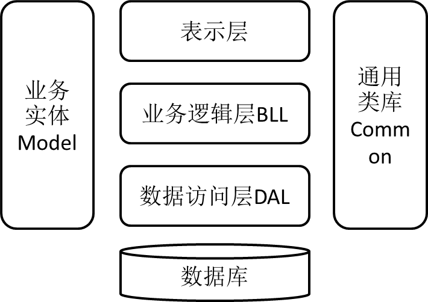

# AddressBook
本项目是根据周宏斌、温一军主编的《C#数据库应用程序开发技术与案例教程》实现的程序

官方教辅资源 [在此](http://www.hzcourse.com/web/teachRes/detail/3328/209) ，需要登录（不想注册）

CSDN 有付费资源（没有积分）

## 项目结构说明

[AddressBook](./AddressBook) 是实现任务12之后的状态

[AddressBookSetup](./AddressBookSetup) 是任务9实现的安装程序项目，编译后可以移动到用户电脑安装使用

[AddressBookMVC](./AddressBookMVC) 是任务13实现的 MVC 架构的重构项目

[SqlServerSetting](./SqlServerSetting) 是SQL Server 数据库环境的恢复脚本，脚本中包含了登录的用户名和密码(同为 admin)和任务11的存储过程，但缺少外键。可根据 [SqlServerSetting/readme.md](./SqlServerSetting/readme.md) 提示配置数据库环境

[assets](./assets) 为存放本说明文件使用的图片的文件夹

另：

可以使用 GitHub 上 [本项目](https://github.com/Tindoc/AddressBook) 的 Tags 来下载或克隆到某一特定时期，现提供 

- “基础篇”：完成基础篇之后的状态
- “进阶篇”：完成进阶篇之后的状态
- “BeforeDbHelper”：实现任务11后的状态

# 任务记录

> 记录一些任务过程中重要或者疑惑的地方

### Task 2

ToolStrip 工具栏上添加的是 button ，根据控件名称 tsbtnxxxx 得知

可以使用类内 static 成员来保存程序整个运行期间不变的变量，类 DBHelper 就是如此

### Task 5

ComboBox 的 DropDownStyle 属性设置为 DropDownList 之后只能在组合框中选取

### Task 7

需要 using System.IO 才可以使用 File 类

**这个备份和恢复只能在客户端和数据库在同一台主机上才可以实现，暂不支持远程备份**

### Task 11

Stored Procedure 存储过程优点：

- 预编译：存储过程预先编译好放在数据库内，减少编译语句所花的时间
- 缓存：编译好的会进入缓存，第二次执行的速度明显提高
- 减少网络传输：

### Task12

对数据库的操作分为四类：

- 对数据库进行非连接式查询操作，返回多条记录。可以通过 SqlDataAdapter 对象的 Fill 方法来完成
- 对数据库进行连接式查询操作，返回多条查询记录。可以通过 SqlCommand 对象的 ExecuteReader 方法来完成
- 从数据库中检索单个值。可以通过 SqlCommand 对象的 ExecuteScalar 来完成
- 对数据库执行增、删、改操作。可以通过 SqlCommand 对象的 ExecuteNonQuery 来完成

### Task 13

> 其中
>
> 表示层：只提供软件系统与用户交互的接口
>
> 业务逻辑层：负责数据处理的传递
>
> 数据访问层：数据的存取工作
>
> 业务实体：封装实体类数据结构，一般用于映射数据库的数据表或视图（多少个表多少个实体），用以描述业务中的对象，在各层中传递
>
> 通用类库：包含通用的辅助工具类

根据三层的依赖关系添加引用

其中，App.config 文件还是在窗体项目中建立，而不是在 SQLDAL 项目中建立

# 待优化

- 每次写数据库的连接很麻烦 => 实现 DAL 类
- 写弹出消息框也较为麻烦
- 将是否选中 DataGridView 中行的判断封装
- FormContactAdd 和 FormContactDetail 相同函数 FillGroup 和 Check，提取
- 使用 SqlDbHelper 类时创建参数麻烦，而且针对特定数据库
- 任务13 函数 GetModel 判断 datatable 对应的单元格非空很麻烦 => 函数 CheckDataTableCell

# 书籍勘误

- P46 第四行：*（1）定义FormContactList窗体的私有字段。* 应为 *（1）定义FormContact**Detail**窗体的私有字段。*

